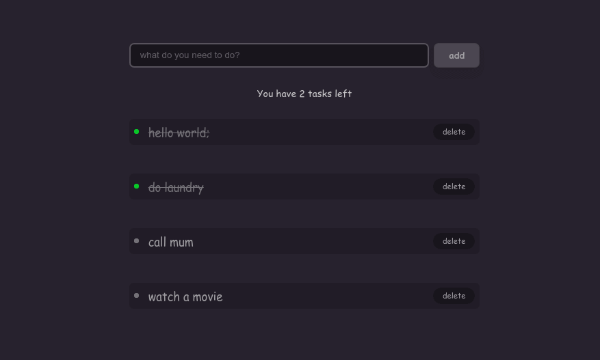

# React-Todo

Todo PWA built with React

[Live Demo](https://reacttodoyinkakun.netlify.app)



## Project setup

### Install dependencies

```sh
yarn install
```

### Serve in dev mode, with hot reload at localhost:8080

```sh
yarn start
```

### Builds for production

```sh
yarn build
```

## License

MIT
